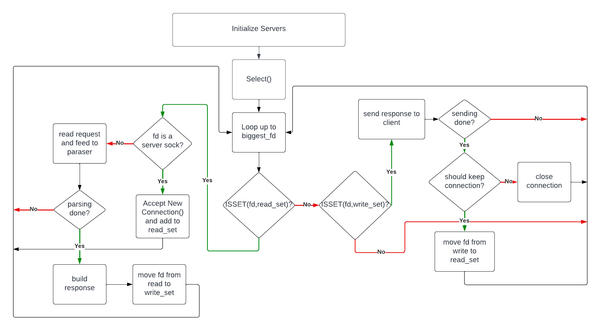

# 06_webserv
---
# Introduction
This project is about writing your own HTTP server.
You will be able to test it with an actual browser.
HTTP is one of the most used protocols on the internet.
Knowing its arcane will be useful, even if you won’t be working on a website.

**Version: 20.7**

# Usage
*This is how run the program...*

...


# Program architecture
*Flowchart + explanations...*

Classes:
- Server:
	- The main server class that handles incoming connections and requests.
	- It will be configured with a configuration file. Server settings like the port to listen on, the root directory for static files...


...


---

# Key new concepts (the magic behind the project)

## 1. Internet Sockets (TCP and UDP)
Everything in Unix is a file: when Unix programs do any sort of I/O, they do it by reading or writing to a file descriptor (an integer associated with an open file). The open file can be a network connection, a FIFO, a pipe, a terminal, a real on-the-disk file...

To request a file descriptor for network communication, the system call **socket()** is used. It returns the socket fd, and you communicate through it using the specialized **send()** and **recv()** calls (read() and write() calls can be used, but with lower control, so not recommended). There are many kinds of sockets, we will focus on DARPA Internet addresses or **Internet Sockets**:

- **Stream Sockets (```SOCK_STREAM```):**
Reliable two-way connected communication streams, used for ssh, http, etc. Use a protocol called “The Transmission Control Protocol” (TCP) , which checks that data arrives sequentially and error-free. Is part of “TCP/IP” (“IP” stands for “Internet Protocol”). IP deals with routing and TCP is responsible for data integrity.

- **Datagram Sockets (```SOCK_DGRAM```):**
Faster than TCP, but not as reliable. They do not maintain an open connection as you do with stream sockets, just send the data (it does not guaranty the arrival of the data). Datagram sockets also use IP for routing, but they don’t use TCP; they use the “User Datagram Protocol” (UDP).

## 2. Internet Protocol (IP):
IPv4 network routing system which defines addresses of the "computer" in a network using four bytes (32 bits), e.g.:```192.168.0.11```, which is used in conjunction with TCP or UD to transfer data. In addition to the address of the "computer", the **port number** is used to locate the service in a given address. It’s a 16-bit number (short).

Since each computer arranges memmory in differnet sequence (little endian / big endian), is key to make sure the data stream is sorted correctly. Some functions are built in to make sure that the information is re-arranged if needed:
```c
htons()	// host to network short
htonl()	// host to network long
ntohs()	// network to host short
ntohl()	// network to host long
```

### 2.1 Binary Representation of the IP address:
A socket descriptor is an ```int```, but for the address it needs to connect to, the following struct is used (it is a linked list, since there could be more than one address.):
```c
struct addrinfo
{
	int			ai_flags;	// AI_PASSIVE, AI_CANONNAME...
	int			ai_family;	// AF_INET for IPv4 (others: AF_INET6, AF_UNSPEC)
	int			ai_socktype;	// SOCK_STREAM, SOCK_DGRAM
	int			ai_protocol;	// use 0 for "any"
	size_t			ai_addrlen;		// size of ai_addr in bytes: use sizeof()
	struct sockaddr *	ai_addr;	// struct sockaddr_in or _in6
	char *			ai_canonname;	// full canonical hostname

	struct addrinfo *	ai_next;	// linked list, next node
};


struct sockaddr
{
	unsigned short	sa_family;		// AF_INET for IPv4 
	char		sa_data[14];	// 14 bytes of protocol address
}; 
```

A pointer to a ```struct sockaddr_in``` can be cast to a pointer to a ```struct sockaddr``` and vice-versa. So even though ```connect()``` requires a ```struct sockaddr *```, a ```struct sockaddr_in *``` can be used.
```c
struct sockaddr_in // for IPv4 only
{
	short int			sin_family;		// AF_INET for IPv4 
	unsigned short int	sin_port;		// Port number
	struct in_addr		sin_addr;		// Internet address
	unsigned char		sin_zero[8];	// to maintain same size as struct sockaddr. should be set to all zeros.
};


struct in_addr // for IPv4 only. Internet address (a structure for historical reasons)
{
	uint32_t s_addr;	// that's a 32-bit int (4 bytes)
};
```

### 2.2 Converting an IPv4 address to binary and vice-versa:
```inet_pton()```, converts an IP address in numbers-and-dots notation into a ```struct in_addr```. ```inet_pton()``` returns ```<=0``` on error:
```c
struct sockaddr_in	sa;

inet_pton(AF_INET, "10.12.110.57", &(sa.sin_addr));
```

and vice-versa:
```c
char				ip4[INET_ADDRSTRLEN];	// space to hold the IPv4 string
struct sockaddr_in	sa;						// pretend this is loaded with something

inet_ntop(AF_INET, &(sa.sin_addr), ip4, INET_ADDRSTRLEN);
printf("The IPv4 address is: %s\n", ip4);
```

## 3. Connecting to Internet 
The sequence to follow to allow communication from a socket to the internet is as follows:

```getaddrinfo() --> socket() --> bind() --> listen() --> accept()```
1. Define the address to where you want to connect (IP, in binary)
2. Define a file descriptor 
3. Bind the file descriptor to a port
4. Wait for the connection
5. Acceopt incomming communication from the internet

### 3.1 Adress
The address is defined in binary, and can be gennerated manually or ussing the ```getaddrinfo()``` function, which receives three input arguments, and returns a pointer to a linked-list, ```res```, of results.:
```c
#include <sys/types.h>
#include <sys/socket.h>
#include <netdb.h>

int getaddrinfo(const char *node, const char *service, const struct addrinfo *hints, struct addrinfo **res);

// node: host name to connect to (or IP address) --> "www.example.com" or IP
// service: "http","ftp"... or port number (80, 21...)
// hints: 
// res: pointer to the linked list with the output
```
.

.

.

.

.... HASTA AQUÍ ....

.

.

.

.


## 4. Web Server
The primary function of a web server is to store, process, and deliver web pages to clients. The communication between client and server takes place using the Hypertext Transfer Protocol (HTTP).
Pages delivered are most frequently HTML documents, which may include images, style sheets, and scripts in addition to the text content.
Multiple web servers may be used for a high-traffic website.

Once connected (see above), a user agent (e.g.: a web browser) initiates communication by requesting a specific resource using HTTP (see below) and the server responds with the content of that resource or an error message if unable to do so. The resource is typically a real file on the server’s secondary storage, but this is not necessarily the case and depends on how the webserver is implemented.
While the primary function is to serve content, full implementation of HTTP also includes ways of receiving content from clients. This feature is used for submitting web forms, including the uploading of files.

## 5. HTTP Communication
The Hypertext Transfer Protocol (HTTP) is an application layer, which is the foundation of data communication for the World Wide Web.

HTTP functions as a request–response protocol in the client–server model. A web browser, for example, may be the client whereas a process, named web server, running on a computer hosting one or more websites may be the server. The client submits an HTTP request message to the server. The server, which provides resources such as HTML files and other content or performs other functions on behalf of the client, returns a response message to the client. The response contains completion status information about the request and may also contain requested content in its message body.
HTTP resources are identified and located on the network by Uniform Resource Locators (URLs), using the Uniform Resource Identifiers (URI's) schemes http and https.

There are 3 standards in use: HTTP/1.1 (1997), HTTP/2 (2015) and HTTP/3 (2022). The main evolution is performance focused:

In HTTP/1.0 a separate TCP connection to the same server is made for every resource request. In HTTP/1.1 instead a TCP connection can be reused to make multiple resource requests (i.e. of HTML pages, frames, images, scripts, stylesheets, etc.). Therefore, latency is reduced as the establishment of TCP connections presents considerable overhead, specially under high traffic conditions.

HTTP/2 is a revision with these differences:
- use a compressed representation of metadata (HTTP headers), since requires much less space
- use a single TCP/IP (usually encrypted) connection per accessed server domain
- use one or more bidirectional streams per TCP/IP connection in which HTTP requests and responses are broken down and transmitted in small packets

HTTP/3 is a revision in order to use QUIC + UDP transport protocols instead of TCP, to improve the average speed of communications.

### 5.1 Intermediate communications
HTTP is designed to permit intermediate network elements to improve or enable communications between clients and servers. High-traffic websites often benefit from web cache servers that deliver content on behalf of upstream servers to improve response time. Web browsers cache previously accessed web resources and reuse them, whenever possible, to reduce network traffic. HTTP proxy servers at private network boundaries can facilitate communication for clients without a globally routable address, by relaying messages with external servers.

To allow intermediate HTTP nodes (proxy servers, web caches, etc.) to accomplish their functions, some of the HTTP headers (found in HTTP requests/responses) are managed hop-by-hop whereas other HTTP headers are managed end-to-end (managed only by the source client and by the target web server).

### 5.2 HTTP application session and authentication
HTTP is a stateless protocol. A stateless protocol does not require the web server to retain information or status about each user for the duration of multiple requests.
Some web applications need to manage user sessions, so they implement states, or server side sessions, using for instance cookies or hidden variables within web forms.
To start an application user session, an interactive authentication via web application login must be performed. To stop a user session a logout operation must be requested by user. These kind of operations do not use HTTP authentication but a custom managed web application authentication.
HTTP provides multiple authentication schemes such as basic access authentication and digest access authentication which operate via a challenge–response mechanism whereby the server identifies and issues a challenge before serving the requested content.

### 5.3 HTTP/1.1 Request Messages Structure
Request messages are sent by a client to a target server, which consist of:
- a request line (consisting of the case-sensitive request method), a space, the requested URL, another space, the protocol version, a carriage return, and a line feed, e.g.:
```
GET /images/logo.png HTTP/1.1
```

- 1 or more request header fields: each consisting of the case-insensitive field name, a colon, optional leading whitespace, the field value, an optional trailing whitespace and ending with a carriage return and a line feed. All header fields except ```Host: hostname``` are optional., e.g.:
```
Host: www.example.com
Accept-Language: en
```
- an empty line, consisting of a carriage return and a line feed.
- an optional message body.

#### 5.4 Request methods
All general-purpose web servers are required to implement at least the GET and HEAD methods, and all other methods are considered optional by the specification.
Method names are case sensitive. This is in contrast to HTTP header field names which are case-insensitive.

- **GET**: requests data retrieval without making changes, addressed through a URL only.
- **HEAD**: like GET request, but without the representation data enclosed in the response body. This is useful for retrieving the representation metadata in the response header, without having to transfer the entire representation. Uses include checking whether a page is available through the status code and quickly finding the size of a file (Content-Length).
- **POST**: create or update resource state with the state defined by the request. 
The POST method requests that the target resource process the representation enclosed in the request according to the semantics of the target resource. For example, it is used for posting a message to an Internet forum, subscribing to a mailing list, or completing an online shopping transaction.[54]
- **PUT**: like POST, but the client specifies the target location on the server.
- **DELETE**: requests that the target resource deletes its state.
- **CONNECT**: requests to establish a TCP/IP tunnel to the target server. It is often used to secure connections through one or more HTTP proxies with TLS.
- **OPTIONS**: requests the target for the HTTP methods that it supports.
- **TRACE**: requests a response body the changes or additions made by intermediaries.
- **PATCH**: requests a resource to be partially modifed. This can save bandwidth.

All general-purpose web servers are required to implement at least the GET and HEAD methods, and all other methods are considered optional by the specification.

### 5.5 HTTP/1.1 Response Messages Structure
A response message is sent by a server to a client as a reply to its former request message, which consist of:

- a status line, consisting of the protocol version, a space, the response status code, another space, a possibly empty reason phrase, a carriage return and a line feed, e.g.:
```
HTTP/1.1 200 OK
```
- zero or more response header fields, each consisting of the case-insensitive field name, a colon, optional leading whitespace, the field value, an optional trailing whitespace and ending with a carriage return and a line feed, e.g.:
```
Content-Type: text/html
```
- an empty line, consisting of a carriage return and a line feed;
- an optional message body.

#### 5.6 Response status codes:
The first line of the HTTP response is called the **status line** and includes a numeric status code (such as "404") and a textual reason phrase (such as "Not Found"). The response status code is a three-digit integer code representing the result of the server's attempt to understand and satisfy the client's corresponding request. The way the client handles the response depends primarily on the status code, and secondarily on the other response header fields. Clients may not understand all registered status codes but they must understand their class (given by the first digit of the status code) and treat an unrecognized status code as being equivalent to the x00 status code of that class.

The first digit of the status code defines its class:

- **1XX** (informational): The request was received, continuing process.
- **2XX** (successful): The request was successfully received, understood, and accepted.
- **3XX** (redirection): Further action needs to be taken in order to complete the request.
- **4XX** (client error): The request contains bad syntax or cannot be fulfilled.
- **5XX** (server error): - **The** server failed to fulfill an apparently valid request.

### 5.7 HTTP/1.1 example of request / response transaction[edit]
Below is a sample HTTP transaction between an HTTP/1.1 client and an HTTP/1.1 server running on www.example.com, port 80.

Client request:
```
GET / HTTP/1.1
Host: www.example.com
User-Agent: Mozilla/5.0
Accept: text/html,application/xhtml+xml,application/xml;q=0.9,image/avif,image/webp,*/*;q=0.8
Accept-Language: en-GB,en;q=0.5
Accept-Encoding: gzip, deflate, br
Connection: keep-alive
```

Server response:
```
HTTP/1.1 200 OK
Date: Mon, 23 May 2005 22:38:34 GMT
Content-Type: text/html; charset=UTF-8
Content-Length: 155		// in bytes
Last-Modified: Wed, 08 Jan 2003 23:11:55 GMT
Server: Apache/1.3.3.7 (Unix) (Red-Hat/Linux)
ETag: "3f80f-1b6-3e1cb03b"	// used to determine if a cached version of the requested resource is identical to the current version of the resource on the server
Accept-Ranges: bytes
Connection: close

<html>
  <head>
    <title>An Example Page</title>
  </head>
  <body>
    <p>Hello World, this is a very simple HTML document.</p>
  </body>
</html>
```
---

# Additional Resources:
## Videos:

- **Coding sockets on C (videos):**

	- [How to build a web client? (sockets)](https://www.youtube.com/watch?v=bdIiTxtMaKA&t=316)

	- [Program your own web server in C. (sockets)](https://www.youtube.com/watch?v=esXw4bdaZkc)

	- [Socket servers can get client addresses. (accept, inet_ntop)](https://www.youtube.com/watch?v=1jv428xKsRg)

	- [How to write a multithreaded server in C (threads, sockets)](https://www.youtube.com/watch?v=Pg_4Jz8ZIH4)

	-  [Multithreaded Server Part 2: Thread Pools](https://www.youtube.com/watch?v=FMNnusHqjpw)
## Flowcharts:

## Reference Material:
[Beej's Guide to Network Programming, Apr 2023](https://beej.us/guide/bgnet/html/split/)